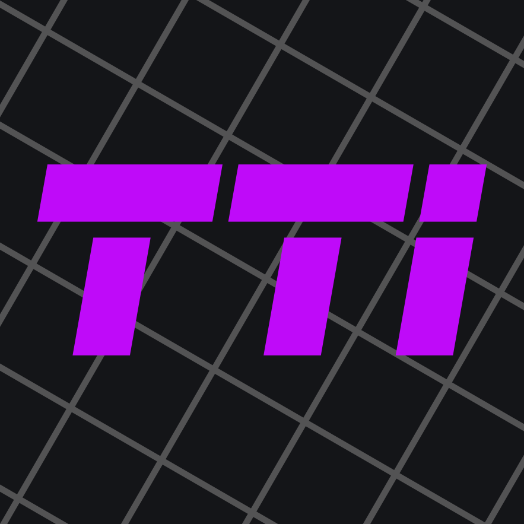

# Wireguard 3 Ways: Cooking Up Security in a Surveillance State

This repository contains instructions and support files for the [HOPE](https://hope.net) workshop.

## Learning Objectives

We break learning objectives into **Skills** and **Concepts**.

### Skills

By the end of this workshop, participants will be able to:

- Create Wireguard peers and servers
- Establish Wireguard networks across NAT boundaries

### Concepts

By the end of this workshop, participants will understand:

- Wireguard tunnel design
- Wireguard asymmetric cryptography usage
- Wireguard networking strategies
- Basic mesh networking principals

## Requirements

### Technical Requirements

This workshop uses [Podman](https://podman.io) for its demonstrations. It can be installed on Linux, Windows or macOS. On Windows, Podman Desktop will require either [WSL](https://learn.microsoft.com/en-us/windows/wsl/install) or Hyper-V to virtualize a small Linux kernel. We will also use Podman Compose, which is a package install for Linux, but [Podman Desktop](https://podman-desktop.io/docs/compose) can support this function as well.

The workshop will also use [Zellij](https://zellij.dev) for easy terminal control of the containers. If not participating with the provided resources, I recommend installing it.

The containers will have several terminal-based text editors installed (Vim, Nano, Helix) to suit your preference. But you will be editing text in the terminal.

### Prerequisites

Familiarity with the Linux command line will be extremely helpful in this workshop. As will familiarity with basic networking concepts such as subnets and firewall rules.

### Cloud VM

The Recipes provided in this repository are wholly self-contained. You can run them on any platform that supports Podman/Podman Compose. However, for full participation in the workshop, you will need two resources I can't provide for you:

1. A registered domain name
2. A cloud-hosted virtual machine

These are not zero-cost, zero-identity activities, and as such are optional. However, the workshop will involve demonstrating how to set up a real Wireguard network for use across the internet, which means public-facing assets. If you intend to fully participate in the workshop, these will be necessary.

I recommend [Porkbun](https://porkbun.com) or [Namecheap](https://namecheap.com) for a domain registrar, and [Digital Ocean](https://digitalocean.com) for a VPS provider.

## Usage

Here are provided 3 "recipes" for creating Wireguard networks, in increasing complexity—and utility. Each is comprised of [Podman](https://podman.io) containers, networked together. They can be run on any platform that Podman supports, but for the HOPE workshop, a cloud VM will be provided for participants.

### Zellij

The recipes provded each have a startup script that performs some housekeeping on the Podman containers. It also launches a helper terminal multiplexer called [Zellij](https://zellij.dev). If you aren't using the provided resources, I recommend installing Zellij to make full use of the environment.

Zellij will create terminal windows for all necessary containers, as well as a separate window for interacting with the host itself. Zellij is mouse-sensitive and fairly intuitive—well, for a terminal tool.

## The Recipes

I know it says "3 ways" on the box, but actually we need to start with a fundamental dish before moving on to the real recipes.

### 0. A Simple Mesh

In this recipe, all our peers live on the same network. That could make Wireguard redundant, but it will establish an additional layer of encryption on top of all peer-to-peer communications. This recipe is more about learning the concepts of Wireguard configurations. Each peer connects to every other peer via manual point-to-point connections. This works, but doesn't exactly scale.

### 1. The Lighthouse

If we want to connect multiple hosts across networks, but we don't want to open inbound ports, we need to use a public server that all our peers can see. This "lighthouse" server will be the one to which all the others connect.

### 2. The Lighthouse + Subnet Router

What if we want access to an entire home network without wanting to configure Wireguard on all of those devices? That's where "subnet routers" come in. This configuration allows a (Linux) Wireguard host to provide access to its neighbors through the Wireguard tunnel.

### 3. The Coordinated Mesh

One of the shortcomings of the "lighthouse" model is that the lighthouse becomes a termination point for the Wireguard encrypted tunnel. If we have doubts about our cloud service provider, then any otherwise unencrypted traffic may be sniffed with access to this server. But we need a central point that everyone can see to guarantee connection. How to square this circle?

[Tailscale](https://tailscale.com) solves this problem by using multiple strategies to show peers how to connect, and then allows the peers to connect directly to each other, eliminating the machine-in-the-middle. And it's all built on top of Wireguard, so you get the same security with much less hassle.

But Tailscale is a cloud service. So suppose you didn't want to entrust your data there either? Luckily, the core of Tailscale is open source—both client daemon and server. [Headscale](https://headscale.net) is a way to self-host a Tailscale server and network. The setup for Headscale is *considerably* easier than raw Wireguard.

## How to Use This Repo

The source of this repo is fully readable here, but the online "book" version for easy reading is online at [https://w3w.taggartinstitute.org](https://w3w.taggartinstitute.org).

Read along and follow the provide instructions to participate in the workshop!

## Instructions

See the [docs](docs/SUMMARY.md) folder for the instructions. Or click next if you're reading the book!

> 
<i>Made with 💜 by <a href="https://taggartinstitute.org">The Taggart Institute</a></i>

> 

