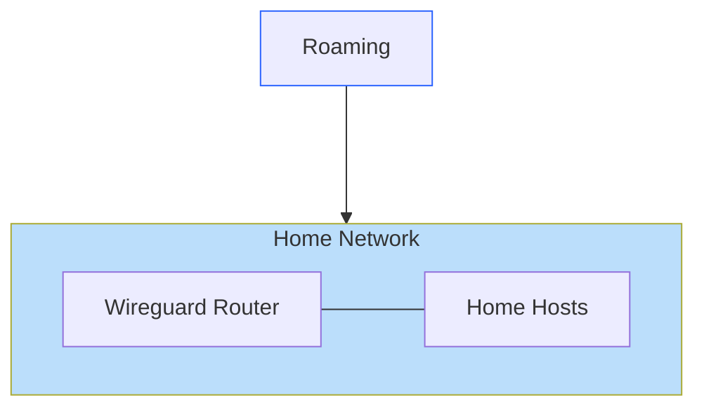

# Recipe 1: The Lighthouse

Our next Recipe simplifies our configuration by using a central "server" to which all other Peers connect. We call this server a "lighthouse" both because everyone needs to be able to see it, and because it will be hanging out there on rocky shores, also known as "the cloud."

In the Podman demo, the Lighthouse is just in another network segment. But in real-world application, you want the Lighthouse to be hosted someplace that's accessible anywhere in the world.

```mermaid
flowchart TD
    Lighthouse["Lighthouse🔦"] --- Peer["wg-home"] & n2["wg-roaming"]

    style Lighthouse stroke:#2962FF
    style Peer stroke:#00C853
    style n2 stroke:#D50000
```



## Different Networks

Have a look at `podman-compose.yml` in this folder. You don't need to understand all the syntax here, but notice that each entry in the `services` section has a `networks` field. And there's a corresponding `networks` section at the bottom of the file. We have two networks defined: `roaming`, which is a stand-in for "the internet and everything not our home network," and `home`.

Imagine being on hotel Wi-Fi. You can't directly see a Wireguard peer that's back at home since it's behind a different router. We could open up ports on our home router, but that comes with pretty significant risks that we're trying to avoid here. Instead, we want a single point that all our Peers can see at once. That's our Lighthouse, and the easiest place to set one up is on a public cloud hosting provider. Our Podman deployment simulates that arrangement without the need for creating a cloud virtual machine.

There's one other important aspect of the setup visible in this file. Take a look at the `lighthouse` entry. You'll see a section that reads:

```yaml
sysctls:
  net.ipv4.ip_forward: 1
```

This configures the lighthouse server to forward IP packets on to their intended destination using the system's routing. That means if it receives a packet intended for someone else—like say one Peer trying to reach another—it will forward the packet along however it knows how. This setting is how we turn a single Wireguard Peer into a lighthouse that allows many hosts to interconnect through one point. This trick is also why the lighthouse server is always a Linux/Unix-like device. IP forwarding is very simple to get going on these operating systems.

## Recipe Setup

In the `recipe-1` folder, run the `start.sh` script to bring up our peers.

## Wireguard Config

This time, each hosts Wireguard config (`/etc/wireguard/recipe-1.conf`) has a keypair configured. What remains is for us to connect the two peers to the lighthouse.

In this model, each non-lighthouse Peer adds the same information to their `Peer` entry: the lighthouse's public key and IP address, and setting AllowedIPs to the whole `/24` subnet we're using for Wireguard (i.e. `172.16.100.0/24`). That way, all traffic to any IP address in that subnet will be routed to the lighthouse.

For the lighthouse, a separate `[Peer]` entry is required for each Peer, but no `Endpoint` or `PersistentKeepalive` directives. That's because the lighthouse only _receives_ tunnels; it does not initiate them. The `AllowedIPs` field for each peer will be the single IP address assigned to that Peer, written as a `/32` CIDR. 

Again, use `wg-quick up recipe-1` to initiate the tunnels, and `wg-show` to view the tunnel status.

## Usage

Try pinging one Wireguard address from the other! Also, you can try using `netcat` to simulate some network traffic. One one peer, run:

```bash
nc -nvlp 8000
```

This sets up a TCP listener on port 8000. Then, on the other peer, run:

```bash
nc <peer_wireguard_ip> 8000
```

You should see a TCP connection established!

## Addendum: The Road Warrior

There's a common Wireguard setup known as the "Road Warrior" that we are conspicuously ignoring in this workshop. The Road Warrior looks like this:



Instead of relying on a cloud-hosted server, the Road Warrior opens a port on one's home router, and connects back to that router and linked hosts via that open port. It's simpler, but depending on your threat model, a bit more dangerous. Personally, I consider my home router as a questionable ally at best, given the focus those devices receive from my adversaries. Entrusting a cloud hosting provider can also be quite risky, and there are some I wouldn't use for this purpose, but for me, I'd much rather move the risk to that third party than in my own house.

