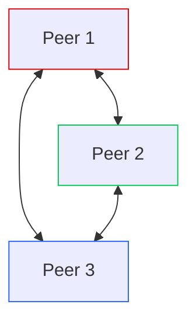

# Recipe 0: A Simple Mesh

We begin our Wireguard journey with the most elemental model: peers connecting to one another. This recipe sets up three hosts, with connections amongst them.



## Wireguard Config

We need to get acquainted with the Wireguard config file. Take a look at `peer.conf`. 

### `Interface`

Each peer defines the details of its own Wireguard interface in the `[Interface]` section. Here the private portion of our keypair is defined. The public key derives from the private key, and for convenience I like to keep the public key in a comment alongide the private.

We also need to define the IP Address our peer will use on the Wireguard network. The ListenPort is optional, but it helps to define this explicitly so we can write firewall rules around known ports.

### `Peer`

Peers sections are a little tricky. Depending on whether the Peer is connecting to us or we're connecting to it, we use the `Peer` section differently. When connecting _to_ another Peer, we need an `Endpoint` directive that defines the non-Wireguard address and point where the Peer is located. We also use a `PersistentKeepalive` directive to keep the tunnel active with intermittent packets sent over the tunnel.

Now let's talk about `AllowedIPs`. This directive changes meaning depending on whether we're defining and incoming or outgoing connection. For incoming connections, `AllowedIPs` defines the IP addresses allowed in. Normally, this is a single IP address: the Wireguard address of the peer, written as in CIDR notation as a `/32` subnet.

For outgoing connections, `AllowedIPs` defines what addresses get routed over the tunnel. Normally then, this will be the full subnet of the Wireguard network, like `172.16.100.0/24`. Later, we'll learn some other tricks with `AllowedIPs`.

## Setup

From this folder, run `./start.sh`.

## Usage

### Writing the Configuration

In this recipe, we do everything the hard way so you know how it all works. We automate most of this in later recipes.

With all the hosts up, we need to build the configurations on each peer. This begins with creating a public and private key for Wireguard to use. Run these commands on each peer, once they're up.

```bash
privkey=$(wg genkey)
pubkey=$(echo $privkey | wg pubkey)
sed -i "s|<<PRIVATE_KEY>>|$privkey|" /etc/wireguard/recipe-0.conf
sed -i "s|<<PUBLIC_KEY>>|$pubkey|" /etc/wireguard/recipe-0.conf

This fills in the public/private key for each peer's configuration. But we're not finished. We also need to decide on IP addresses for each. I'd use the `172.16.100.0/24` subnet. So our IP addresses could be:

- `172.16.100.1/24`
- `172.16.100.2/24`
- `172.16.100.3/24`

Those go in the `Address` section of each peer config.

Now for those `Peer` entries. For each host, we need to create two `[Peer]` entries. Peer 1 needs 2 and 3; Peer 2 needs 1 and 3; and Peer 3 needs 1 and 2. 

For each of these, we'll need the IP address in the non-Wireguard network for our `Endpoint` field. Use `ip address show` (or `ip a s` for short) to get those addresses. 

Finally, add the proper public key from each respective configuration to the appropriate `Peer` entry for all the configuration files. Save all these files and quit back to the containers' terminal prompts.

### Bring up the Wireguard Network


On each host, run `wg-quick up recipe-0` to activate the Wireguard tunnel.

You can then run `wg show` to show the status of the tunnel. If all has gone according to plan, you should have three hosts each showing two connections to other peers. You should also be able to ping those `172.16.100.0/24` addresses.

Congratulations! You brought up a Wireguard mesh the hard way. The subsequent recipes automate a lot of the busywork now that you've had exposure to the concepts.
