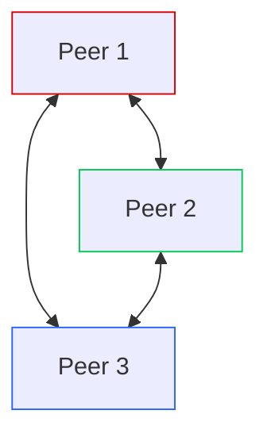

# Recipe 0: A Simple Mesh

We begin our Wireguard journey with the most elemental model: peers connecting to one another. This recipe sets up three hosts, with connections amongst them.

## Wireguard Config

We need to get acquainted with the Wireguard config file. Take a look at `peer.conf`. 

### `Interface`

Each peer defines the details of its own Wireguard interface in the `[Interface]` section. Here the private portion of our keypair is defined. The public key derives from the private key, and for convenience I like to keep the public key in a comment alongide the private.

We also need to define the IP Address our peer will use on the Wireguard network. The ListenPort is optional, but it helps to define this explicitly so we can write firewall rules around known ports.

### `Peer`

Peers sections are a little tricky. Depending on whether the Peer is connecting to us or we're connecting to it, we use the `Peer` section differently. When connecting _to_ another Peer, we need an `Endpoint` directive that defines the non-Wireguard address and point where the Peer is located. We also use a `PersistentKeepalive` directive to keep the tunnel active with intermittent packets sent over the tunnel.

Now let's talk about `AllowedIPs`. This directive changes meaning depending on whether we're defining and incoming or outgoing connection. For incoming connections, `AllowedIPs` defines the IP addresses allowed in. Normally, this is a single IP address: the Wireguard address of the peer, written as in CIDR notation as a `/32` subnet.
