# Recipe 1: The Lighthouse

Our next Recipe simplifies our configuration by using a central "server" to which all other Peers connect. We call this server a "lighthouse" both because everyone needs to be able to see it, and because it will be hanging out there on rocky shores, also known as "the cloud."

In the Podman demo, the Lighthouse is just in another network segment. But in real-world application, you want the Lighthouse to be hosted someplace that's accessible anywhere in the world.

```mermaid
flowchart TD
    Lighthouse["Lighthouse🔦"] --- Peer["Peer 1"] & n2["Peer 2"] & n1["Peer 3"]

    n1@{ shape: rect}
    style Lighthouse stroke:#2962FF
    style Peer stroke:#00C853
    style n2 stroke:#D50000
    style n1 stroke:#AA00FF
```

