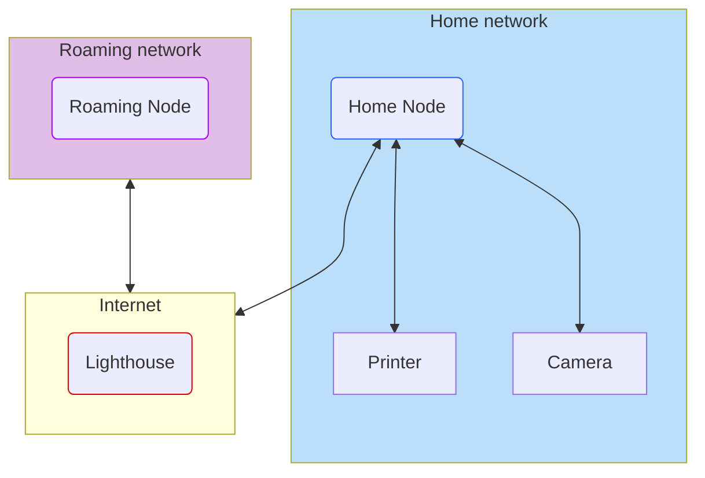

# Recipe 2: The Lighthouse + Subnet Router

This one is a minor modification of the Lighthouse from the last recipe, but an important one. The lighthouse as we defined it works great to connect Wireguard clients together, but what about devices that can't run Wireguard? What if you just _have_ to have access to that sweet, sweet Brother printer in your home office? Or more modernly, what if you want to access your local-only security cameras?

In this recipe, one of our Peers connecting to the lighthouse has a trick up its sleeve. Despite being an ordinary Linux box, it serves as a router, allowing Wireguard peers to access the networks it can access. This "subnet router" provides Wireguard clients access to an entire home network through a single node.

