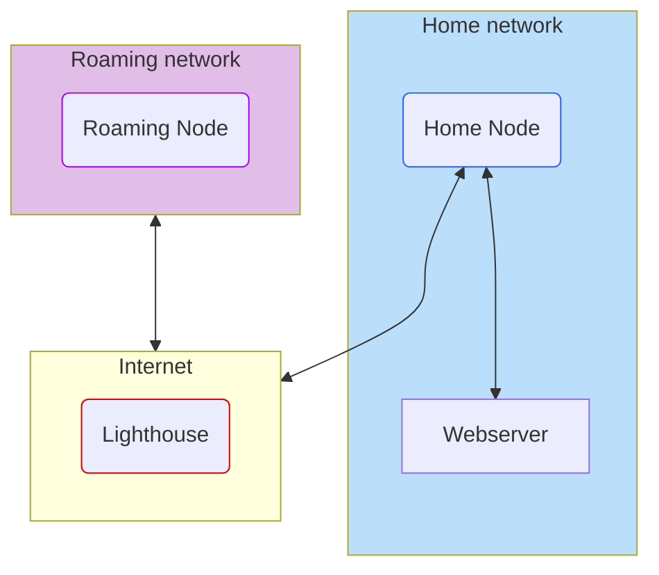

# Recipe 2: The Lighthouse + Subnet Router

This one is a minor modification of the Lighthouse from the last recipe, but an important one. The lighthouse as we defined it works great to connect Wireguard clients together, but what about devices that can't run Wireguard? What if you just _have_ to have access to that sweet, sweet Brother printer in your home office? Or more modernly, what if you want to access your local-only security cameras?

In this recipe, one of our Peers connecting to the lighthouse has a trick up its sleeve. Despite being an ordinary Linux box, it serves as a router, allowing Wireguard peers to access the networks it can access. This "subnet router" provides Wireguard clients access to an entire home network through a single node.



## Lab Setup

In the `recipe-2` folder, run the `start.sh` script. As before, this will initialize the Podman containers. This lab starts 4 containers:

1. The home router
2. A non-Wireguard webserver on the home network
3. A roaming Wireguard client on a separate network
4. The lighthouse server

To save a little time, this lab setup automates the assignment of Wireguard IP addresses in the config files.

## Router Config

To see how this works, take a look at `home-router/home-router.conf`. It's a Wireguard config, similar to the ones we've seen previously, but this one has a whole mess of `PostUp` and `PostDown` commands. Wireguard allows you to execute arbitrary commands upon startup aand shutdown. These commands set up firewalls rules to forward IP traffic from the Wireguard interface to the router's local interface, and "masquerade" the IP address—that is, pretend the packet is from the route rinternally, but translate it back to the original source once a response is received.

> The commands here use [nftables](https://wiki.nftables.org/wiki-nftables/index.php/Main_Page) to create the firewall rules. NFTables is the successor to iptables, but the syntax is way more arcane. In your own configs, if you prefer iptables or firewalld commands, that's just fine.

This works in conjunction with the IP forwarding configuration on the lighthouse. Not much changes from the last configuration, save for the `AllowedIPs` field of the `[Peer]` config for our home router. While every other peer connecting to the lighthouse has a single IP in this field, the home router has a single IP, _and_ the whole home subnet. That looks like:

```
AllowedIPs = 172.16.100.2/32, 192.168.99.0/24
```

When a request for a home network address comes over the lighthouse tunnel, the lighthouse will use its routing rules (created by Wireguard) to send the traffic down to the home router. The home router, in turn, handles the traffic with its firewall rules. And that's how we present an entire home network to Wireguard via one—well two—peers.

## Lab Exercise

We went to the trouble of setting up a webserver in the home network. Can you use `cURL` to access it from the roaming Wireguard client?

```bash
curl http://182.168.99.10
```


When you're done exploring, stop the containers with `stop.sh` in the `recipe-2` folder.
