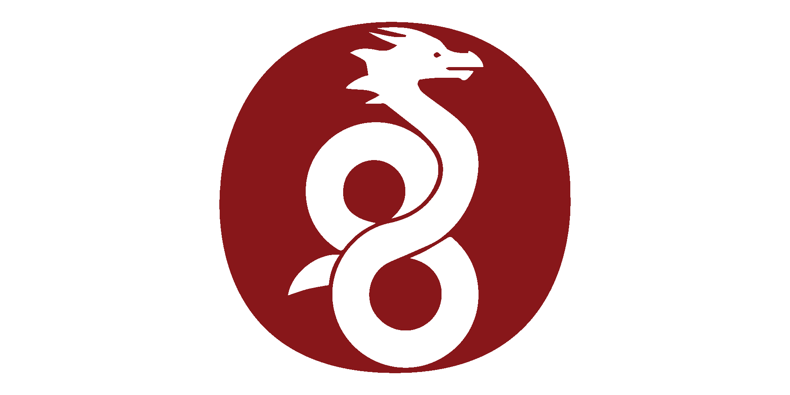
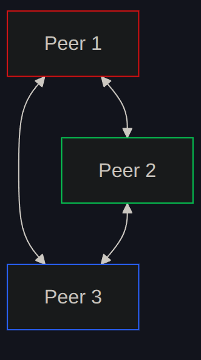
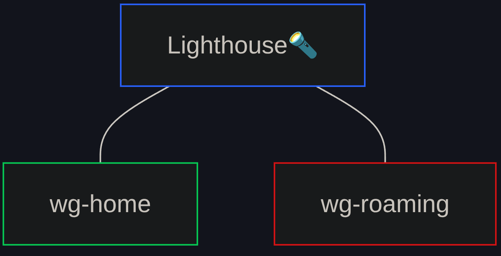
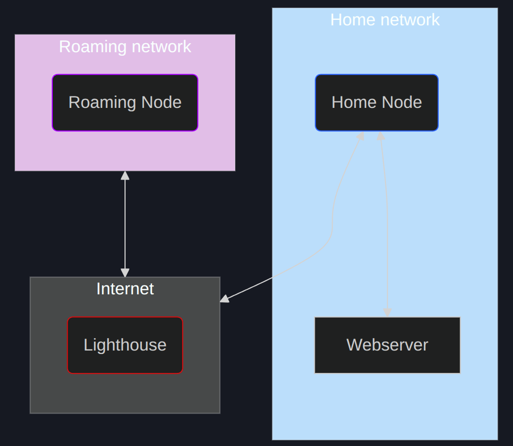

<center>
<h1>Wireguard 3 Ways</h1>

**Cooking up Security in a Surveillance State**

**Michael Taggart**
</center>

 @mttaggart@infosec.exchange
 @taggart-tech.com

15 August 2025

Hackers on Planet Earth
Queens, New York, NY, USA

# Whoami

- Michael Taggart
  - Just call me Taggart
- Senior Cybersecurity Researcher at UCLA Health


- Founder of <span style="color:magenta">The Taggart Institute</span>
  - We make low-cost, high-value tech training
  - taggartinstitute.org


# Agreements

- This is a safe, supportive place to learn
- I make mistakes
  - They are not the point
- Questions should be seeking knowledge, not demonstrating knowledge
- Play nicely with my equipment

# Learning Objectives: Skills

By the end of this workshop, participants will be able to:

- Create Wireguard peers and servers
- Establish Wireguard networks across NAT boundaries

# Learning Objectives: Concepts

By the end of this workshop, participants will understand:

- Wireguard tunnel design
- Wireguard asymmetric cryptography usage
- Wireguard networking strategies
- Basic mesh networking principals

# Prerequisites

- Command line comfort is a plus
- Basic networking (IP addresses, subnets)

# Materials

- A computer (the kind with a keyboard)
  - Web browser
  - SSH Client (Windows has one, don't worry)
  - Tailscale (https://tailscale.com/download)
- If you want to run it all yourself:
  - Zellij (https://zellij.dev)
  - Podman (https://podman.io)
    - Must be v5.0+
  - Windows: strongly recommend using the managed lab
    - Or another VM you have!

# Not-Free Stuff

The end of the workshop has an optional paid component: you setting up your own server for private networking!

This requires:

- A cloud VM (AWS, Azure, Digital Ocean, Hetzner, Vultr)
- A domain name (Namecheap, Porkbun)


# The Book

### https://book.wg3w.app

# Joined Matrix?

- Cinny >>> Element: https://app.cinny.in
- I'm `@taggart:taggart.social`
- We have a Room!
- I'll be watching for questions

# Today's Agenda

1. About Wireguard
2. Why use it?
3. Lab setup
4. Break
4. Recipe 0: A Simple Mesh
5. Recipe 1: The Lighthouse
6. Recipe 2: Lightouse + Subnet Router
7. Recipe 3: Coordinated Mesh with Headscale
8. Break
9. Going Live: Your Own Headscale Server


# About Wireguard



# Why Use Wireguard?

- Trust and Risk
- What is the Threat Model
- The Wireguard Value Proposition:
  - Simplicity
  - Ubiquity
  - Performance
  - Cryptography
- Fun

# Example Use Case

Outside of normal VPN uses, why might you use a private Wireguard network in this climate?

- Political activism/organizing
- Secure dissemination of "subversive" materials
- Zero-cloud access to remote compute resources

# Lab Setup: Managed Lab

1. Install Tailscale
2. Don't use the GUI, Windows people!

```bash
tailscale login --login-server=https://wg3w.app
```

3. Instead of visiting the URL, copy the last part
4. Go to `https://auth.wg3g.app`
5. Enter the secret key: `CHANGEME` 
6. Enter the registration code you copied.
7. `ssh $your-username@wg3w-lab`

# Lab Setup: BYO

1. Podman (and `podman-compose`, *Nix people) installed.
2. Git installed
3. Zellij Installed
4. `git clone https://codeberg.org/The-Taggart-Institute/wireguard-3-ways`
5. `cd wireguard-3-ways`

# Break

# Recipe 0: A Simple Mesh

<!--
- Asymmetric keys
- wg genkey/pubkey
- Config format
- AllowedIPs
- wg-quick
-->



# Recipe 1: The Lighthouse

<!--
- Everyone connects to one thing in line of sight
- Most peers have only outgoing entries
- IP Forwarding
- Netcat
-->



# Recipe 2: Lightouse + Subnet

<!--
- Firewall rules
- AllowedIPs
- Tracepath
- cURL
- The Dirty Secret
-->



# Recipe 3: Coordinated Mesh

<!--
- Headscale
- Nodes
- Authkeys/Preauthkeys
- We just did that for the lab!
-->

# Break

# Going Live

## Your Personal Private Networking Server

# Cloud VM

## VPS Options

- Digital Ocean 👌
- Vultr 🤨
- Hetzner 😬
- Azure 👹
- AWS 😡

# DNS

- Namecheap
- Porkbun
- Create an `A` record to the VM's IP Address

# Headscale Setup

- Headscale users
- `/etc/headscale/config.yaml`
  - `server_url`
  - `listen_addr`
  - `acme_email`
  - `tls_letsencrypt_hostname`

# Thank you!

## Questions?

 @mttaggart@infosec.exchange
 @taggart-tech.com
